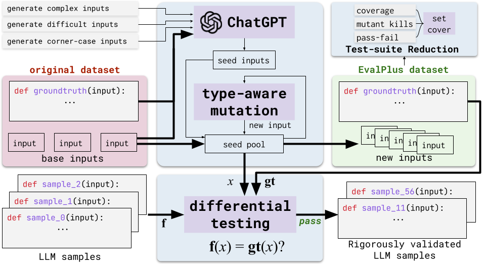

# `EvalPlus(📖) => 📚`

> **Warning**
> <div align="center">
> <b>
> 🚨 Evaluating LLM-generated code on a dataset with just _3_ test-cases is NOT enough! 🚨
> </b>
> </div>

To address this, we started the EvalPlus project -- a rigourous evaluation framework for LLM4Code that:

+ ✨ improves programming benchmarks by patching up to thousands of new tests! `EvalPlus(HumanEval) => HumanEval+` (81x new tests!)
+ ✨ crafts a set utility tools to sanitize, visualize and inspect LLM-generated code and evaluation results!
+ ✨ accelerates LLM4Code research by open-sourcing LLM-generated samples for 14+ models -- no to re-run the expensive benchmarks!



## Use EvalPlus-Enhanced Dataset

To get started, please first setup the environment:

```bash
git clone https://github.com/evalplus/evalplus.git
pip install -r requirements.txt
```

### HumanEval+

```python
from evalplus.data import get_human_eval_plus

fe = get_human_eval_plus() # -> a list of dictionaries (each is a programming problem)
# "task_id" is the identifier string for the task
# "entry_point": name of the function
# "prompt" is the function signature with docstring
# + "canonical_solution" is the ground-truth implementation (re-implemented to fix bugs in HumanEval)
# + "base_input" is the test inputs in original HumanEval
# + "plus_input" is the test inputs brought by EvalPlus
# and others...
```

### MBPP+ (TBD)


## Useful tools

### Syntax Checker for LLM-generated Code

Check LLM-produced code and answer the following questions:

1. Is the generation entirely done for all samples / all problems in the dataset?
2. Are LLM-generated code compilable? (if no, something could be wrong and you'd better check)

```shell
python tools/checker.py --folder /path/to/[model]-[??]b_temp_[??] --dataset humaneval
```

### Post Code Sanitizer

LLM-generated code may contain some syntax errors.
But some of them can be easily fixable by doing simple post-processing.
This tool will make the LLM-generated code more clean/compilable by doing certain post-processing such as trimming with more magical EOFs and some garbage non-code tokens.

```shell
python tools/sanitize.py --eof --folder /path/to/vicuna-[??]b_temp_[??]
# Sanitized code will be produced to `/path/to/vicuna-[??]b_temp_[??]-sanitized`
```

### Render `pass@k` Results to `rich` and LaTeX Tables

```shell
python tools/render.py --type /path/to/[model]-[??]b # NOTE: no `_temp_[??]`
```


### Perform Test Input Generation from Scratch (TBD)


## Development

Before you start:

```bash
pip install -r requirements.txt
pre-commit install
export PYTHONPATH=$PYTHONPATH:$(pwd)
```

### Name Convention

- `evalplus` is the package name.
- `${DATASET}_plus` is the name of dataset applied with `evalplus`.


## Acknowledgement

- [HumanEval](https://github.com/openai/human-eval)
